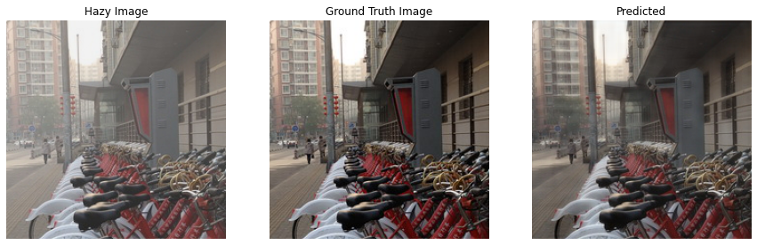
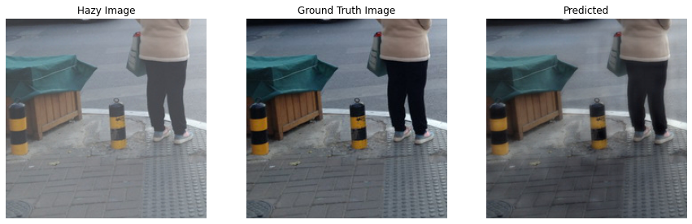
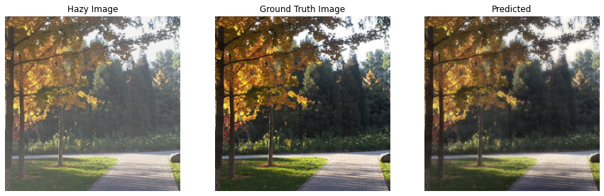
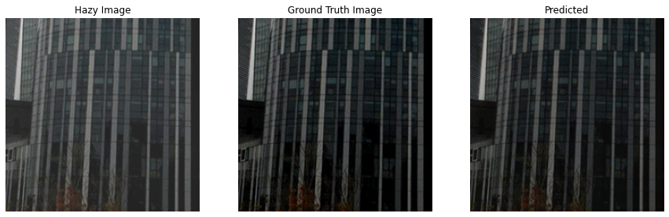
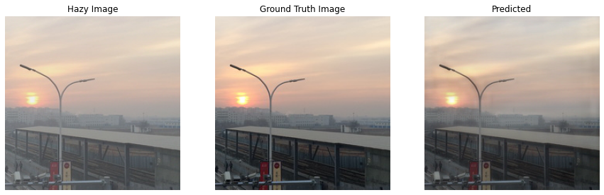

# Image-Dehazing-using-GMAN
PyTorch implementation of <b>Single Image Dehazing with a Generic Model-Agnostic Convolutional Neural Network</b>


<h2>Training</h2>
<ol>
   <li>Used 224x224 randomly cropped images as suggested in the paper </li>
   <li>Used Mean Squared Loss to train the model</li>
</ol>

<h3>Note:</h3>
<p>The model currently works with only 224x224 images. Will look into this issue later 😔</p>


<h2>Validation Images</h2>








<h2> Steps to use the trained model </h2>
<ol>
   <li>Download the state_dict_model.pt </li>
   <li>Copy the code for model from the notebook </li>
   <li>Create a model object and load the model from the downloaded weights</li>
</ol>

<h2>Code</h2>

```
import torch

class ResidualBlock(nn.Module):
    model code...

class GMAN(nn.Module):
    model code...
    


PATH_TO_MODEL = '../../state_dict_model.pt'
    
device = torch.device('cuda' if torch.cuda.is_available() else 'cpu')

gman_net = GMAN().to(device)
if torch.cuda.is_available():
    gman_net.load_state_dict(torch.load(PATH_TO_MODEL))
 else:
    gman_net.load_state_dict(torch.load(PATH_TO_MODEL, map_location='cpu'))
```


<h2>Citation</h2>

```
@article{liu2019single,
  title={Single Image Dehazing with a Generic Model-Agnostic Convolutional Neural Network},
  author={Liu, Zheng and Xiao, Botao and Alrabeiah, Muhammad and Wang, Keyan and Chen, Jun},
  journal={IEEE Signal Processing Letters},
  volume={26},
  number={6},
  pages={833--837},
  year={2019},
  publisher={IEEE}
}
```
